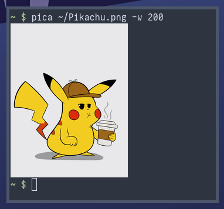

# pica - picture cat
Pica converts images to sixel graphics, and outputs them to stdout. The tool
achieves high quality output by making use of the
[libimagequant](https://pngquant.org/lib/) library for converting RGBA images
to the sixel palette.

Not all terminals support sixels. I have personally tested pica in xterm on
Xorg and foot on Wayland.



```
USAGE:
    pica [OPTIONS] [<FILE>...]

    If FILE is omitted, pica reads a single image from stdin.

OPTIONS:
    -w, --width <pixels>    Output image width in pixels
    -h, --help              Display this help page
```
